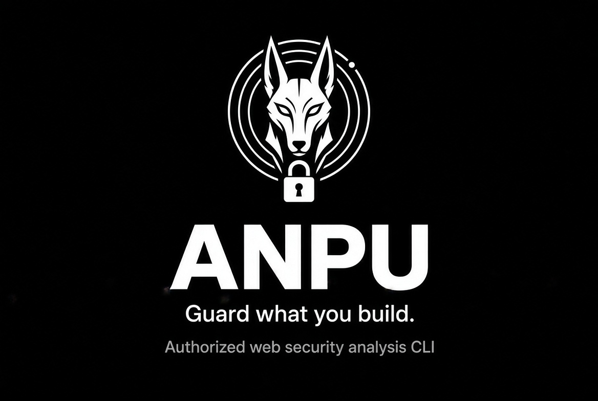

<p align="center">
  
</p>

# ANPU

**Guard what you build.** *Authorized web security analysis and attack-surface intelligence CLI.*

[Install](#3-installation) · [Documentation](#5-architecture) · [Releases](https://github.com/Marwanmorsy999/anpu/releases)

[](https://github.com/Marwanmorsy999/anpu/actions) [](https://go.dev/) [](LICENSE) [](https://docs.oasis-open.org/sarif/sarif/v2.1.0/sarif-v2.1.0.html) [](https://docs.docker.com/)

### Quick links

- [Risk Scoring Deep Dive](docs/scoring.md)
- [CI/CD Integration](docs/ci-cd.md)
- [Security Policy](SECURITY.md)
- [Contributing](CONTRIBUTING.md)
- [Changelog](CHANGELOG.md)

```text
$ anpu scan https://example.com

        ▄▀█ █▄░█ █▀█ █░█
        █▀█ █░▀█ █▀▀ █▄█
   Web Security Intelligence

Target: https://example.com

Recon              ✓
Technology         ✓
TLS                ✓
Headers            ✓
Cookies            ✓
Endpoints          ✓

Results
CRITICAL     0
HIGH         0
MEDIUM       2
LOW          5
INFO         11

Risk Score: 3.4/10
Report: ./reports/example.com-2026-01-01-120000.html
```

## 1. What ANPU is

ANPU is a local-first security analysis CLI. It combines its own passive and low-impact analyzers with optional external scanners, normalizes their results into one evidence-backed finding model, deduplicates overlapping findings, scores them deterministically, and produces machine-readable and human-readable reports.

ANPU is **not** a from-scratch replacement for every security scanner. Its value is the orchestration and intelligence layer that turns multiple security signals into one understandable assessment.

## 2. What it does

- **Recon**: DNS resolution, robots.txt/sitemap.xml parsing, redirect-chain observation, and source-map exposure detection.
- **HTTP / security headers**: CSP, HSTS, X-Content-Type-Options, Referrer-Policy, Permissions-Policy, Server/X-Powered-By disclosure.
- **Cookies**: Secure, HttpOnly, SameSite, with context-aware severity.
- **TLS**: certificate validity, expiration, hostname match, protocol version, and HTTP→HTTPS redirect behavior.
- **Technology fingerprinting**: web servers, frameworks, CMSs, CDNs, JS libraries — using observed signals without inventing versions.
- **Endpoint discovery**: links, forms, and JavaScript references, normalized and categorized.
- **Subdomains / ports / paths**: profile-gated discovery engines with safety and false-positive safeguards.
- **Secret detection**: scans discovered content for supported credential/token patterns without treating target-controlled data as executable.
- **CORS / HTTP methods**: targeted configuration and method checks behind the same SSRF protections as core requests.
- **Nuclei integration**: optional execution of a real Nuclei binary, with profile-aware template scope and graceful degradation when Nuclei is unavailable.
- **Deduplication**: merges overlapping findings while preserving source evidence.
- **Transparent scoring**: deterministic per-finding and aggregate scoring with explanations stored in results.

## 3. Installation

### Pre-built binaries

The Releases page contains published release artifacts. The `main` branch may be ahead of the latest published release; check the release notes when choosing a version for production use.

Linux amd64 is currently the published native binary target. Other platforms can use Docker or build from source.

```sh
tar -xzf anpu_*.tar.gz
./anpu --help
```

### Build from source

```sh
git clone https://github.com/Marwanmorsy999/anpu
cd anpu
go build -o anpu ./cmd/anpu
./anpu --help
```

Dependencies are defined in `go.mod` and pinned through `go.sum`. A first build normally needs access to the configured Go module proxy (or an already-populated local module cache). Subsequent builds can reuse the cached modules.

### Docker

The image uses pure-Go SQLite, so no C compiler is required inside the build stage.

```sh
docker build -t anpu .
docker run --rm -v "$(pwd)/reports:/reports" anpu scan https://example.com --output /reports
```

## 4. Quick start

```sh
# Safe (default) profile
./anpu scan https://example.com

# Standard profile with machine-readable output
./anpu scan https://example.com --profile standard --json --sarif

# View past scans
./anpu history

# Re-view a specific scan
./anpu show scan-1234567890-1

# Compare two historical scans
./anpu diff scan-old scan-new
```

`safe` is the default and is designed for passive/low-impact analysis. `standard` and `deep` enable more active checks. Only use ANPU against systems you own or are explicitly authorized to test.

## 5. Architecture

```text
cmd/anpu/              CLI entry point (scan, history, show, diff, tools)

internal/
  scanner/              scanner interface, target validation, pipeline orchestrator
  diff/                 historical scan comparison and attack-surface change detection
  recon/                DNS, robots.txt, sitemap.xml, redirects
  http/                 shared HTTP client and SSRF/redirect guards
  technology/           technology fingerprinting
  tls/                  passive TLS analysis
  headers/              security headers + cookie analysis
  endpoints/            endpoint discovery/normalization
  subdomains/           subdomain enumeration
  portscan/             TCP connect port scanning
  dirs/                 sensitive-path discovery and soft-404 filtering
  secrets/              token/key pattern detection
  cors/                 CORS auditing
  methods/              HTTP method auditing
  findings/             deduplication engine
  scoring/              transparent risk scoring
  storage/              SQLite persistence for scan history
  integrations/         Nuclei integration + prepared ZAP interface
  reporting/            JSON / SARIF / HTML report generation and terminal UI
  config/               YAML config loading and CLI-flag resolution

pkg/models/             shared scanner-agnostic data model

docs/                   scoring and CI/CD documentation
```

**Design principle:** `internal/scanner` defines the scanner boundary and pipeline orchestration. Concrete analyzer packages are wired together in `cmd/anpu/scan.go`; the orchestrator works with scanner interfaces rather than hard-coding analyzer internals.

## 6. Scan profiles

| Profile | Passive analysis | Active engines | Nuclei | Purpose |
|---|:---:|:---:|:---:|---|
| `safe` (default) | ✅ | Limited | ❌ by default | Low-impact baseline |
| `standard` | ✅ | ✅ | ✅ when available | Broader security assessment |
| `deep` | ✅ | ✅ | ✅ when available | Broader discovery and active analysis |

Module toggles in `anpu.yaml` can further enable or disable individual engines. `--no-nuclei` and `--no-zap` override integration settings for the current run.

## 7. Scan comparison and CI gates

```sh
# Human-readable comparison
./anpu diff scan-old scan-new

# Machine-readable comparison
./anpu diff scan-old scan-new --json --output ./reports/diff.json

# Fail CI when a scan contains high or critical findings
./anpu scan https://example.com --profile standard --sarif --fail-on high
```

`--fail-on` exits non-zero after reports and scan history have been written. Supported thresholds are `low`, `medium`, `high`, and `critical`; the default is `none`.

See [docs/ci-cd.md](docs/ci-cd.md) for a complete GitHub Actions example.

## 8. Output formats

ANPU can write:

- **HTML** for people and security review.
- **JSON** for automation and downstream processing.
- **SARIF 2.1.0** for SARIF-compatible security tooling.

Reports include observed evidence and score explanations. ANPU does not manufacture evidence when a check could not be verified.

## 9. Integrations

### Nuclei

Nuclei is optional. If a `nuclei` executable is available on `PATH`, ANPU can invoke it using a profile-scoped template set and normalize its JSONL results into ANPU findings. If Nuclei is unavailable, ANPU warns and continues with its built-in analysis.

### OWASP ZAP

The ZAP integration is currently **planned**. The interface exists as an extension point, but the ZAP driver is not implemented yet.

## 10. Development

```sh
go build ./...
go vet ./...
go test ./...
gofmt -l $(find . -name '*.go')
```

For the same checks used by GitHub Actions, see `.github/workflows/ci.yml` and `.github/workflows/scan.yml`.

## 11. Contributing

Contributions are welcome. Start with [CONTRIBUTING.md](CONTRIBUTING.md) and read [SECURITY.md](SECURITY.md) first.

Good starter work is tracked with the [`good first issue`](https://github.com/Marwanmorsy999/anpu/labels/good%20first%20issue) label.

## 12. Responsible use

ANPU performs network requests and, depending on the profile, may perform active discovery. **Only scan targets you own or are explicitly authorized to test.** Built-in guardrails reduce accidental harm but do not establish authorization.

## License

Apache-2.0 — see [LICENSE](LICENSE).
