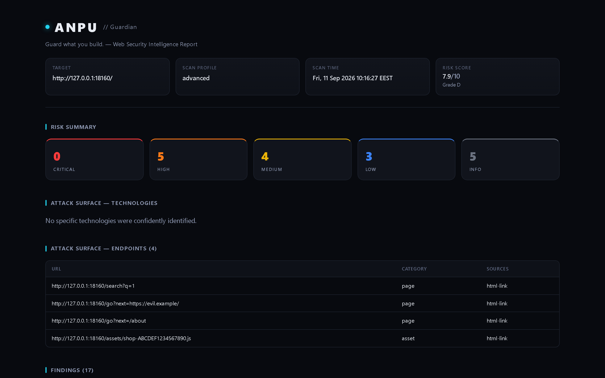

<p align="center">
  
</p>

# ANPU

**Guard what you build.** *Authorized web security analysis and attack-surface intelligence CLI.*

[Install](#3-installation) · [Documentation](#5-architecture) · [Releases](https://github.com/Marwanmorsy999/anpu/releases)

[](https://github.com/Marwanmorsy999/anpu/actions) [](https://go.dev/) [](https://github.com/Marwanmorsy999/anpu/blob/main/LICENSE) [](https://docs.oasis-open.org/sarif/sarif/v2.1.0/sarif-v2.1.0.html) [](https://docs.docker.com/)

### Quick links

- [Release & Installation Guide](docs/releases.md)
- [CLI Reference](docs/cli.md)
- [Configuration Reference](docs/configuration.md)
- [Scanner and Engine Reference](docs/scanners.md)
- [Development and Testing](docs/development.md)
- [Risk Scoring Deep Dive](docs/scoring.md)
- [CI/CD Integration](docs/ci-cd.md)
- [Security Policy](SECURITY.md)
- [Contributing](CONTRIBUTING.md)
- [Changelog](CHANGELOG.md)

```text
$ anpu scan https://example.com --profile advanced --only headers,archiveurls,dirs,active

                        #####+ ###+   ##+######+ ##+   ##+
                       ##+--##+####+  ##|##+--##+##|   ##|
                       #######|##+##+ ##|######++##|   ##|
                       ##+--##|##|+##+##|##+---+ ##|   ##|
                       ##|  ##|##| +####|##|     +######++
                       +-+  +-++-+  +---++-+      +-----+
              G U A R D I A N  │  Web Security Intelligence Engine

                        Target: https://example.com/

── Phase 1 · Foundation — passive intel
[!!] ArchiveURLs      +1
[!!] Headers          +7
[--] Recon            not selected (--only headers,archiveurls,dirs,active)
   ···
── Phase 4 · Active — differentials and confirmations
[!!] Active           +8
   ···

  GRADE D  (7.9/10)  CRITICAL 0  HIGH 5  MEDIUM 4  LOW 3  Info 5
  Top: /.env returned HTTP 200 [HIGH 6.5]
  Report: ./reports/example.com-2026-09-11-103208.html
  Phases: foundation 0s/2  ·  discovery 0s/1  ·  active 33s/1
  Slowest: Active 33.4s  ·  Dirs 0.0s  ·  ArchiveURLs 0.0s  ·  Headers 0.0s
```

Trimmed (`···`) from a real run: skipped stages print their reason, findings bump stage counters (`+N`), and the panel shows grade, top finding, report path, and phase timing.

## 1. What ANPU is

ANPU is a local-first security analysis CLI. It combines its own passive and low-impact analyzers with optional external scanners, normalizes their results into one evidence-backed finding model, deduplicates overlapping findings, scores them deterministically, and produces machine-readable and human-readable reports.

ANPU is **not** a from-scratch replacement for every security scanner. Its value is the orchestration and intelligence layer that turns multiple security signals into one understandable assessment.

Scope notes: the scan grade is driven only by target findings — local-code results (`ANPU_CODE_DIR`/`ANPU_APK`) render as an unscored appendix and never move the grade. Permanently out of scope by policy: brute-forcers, exploit frameworks, DoS tunings, keyed APIs, and REPL-driven consoles; file-read/dump tools that need operator-owned inputs stay adversarial-gated natives-or-wrappers instead.

## 2. What it does

- **Recon**: DNS resolution, robots.txt/sitemap.xml parsing, redirect-chain observation, and source-map exposure detection.
- **HTTP / security headers**: one posture finding with a per-header checklist (CSP, framing, HSTS, XCTO, COOP/COEP/CORP, Referrer/Permissions-Policy) instead of a row per header, plus present-but-weak quality rows and Server/X-Powered-By disclosure.
- **Cookies**: Secure, HttpOnly, SameSite, with context-aware severity.
- **TLS**: certificate validity, expiration, hostname match, protocol version, and HTTP→HTTPS redirect behavior.
- **Technology fingerprinting**: web servers, frameworks, CMSs, CDNs, JS libraries — using observed signals without inventing versions. Body-text mentions (e.g. "WooCommerce" in comparison copy) report as mentions, not detections.
- **Endpoint discovery**: links, forms, and JavaScript references, normalized and categorized. Same-site redirects (apex → www) auto-expand scope so discovery never starves.
- **Subdomains / ports / paths**: profile-gated discovery engines with safety and false-positive safeguards. Backup-file search is request-budgeted.
- **Secret detection**: scans discovered content for supported credential/token patterns without treating target-controlled data as executable.
- **CORS / HTTP methods**: targeted configuration and method checks behind the same SSRF protections as core requests.
- **Nuclei integration**: optional execution of a real Nuclei binary, with profile-aware template scope and graceful degradation when Nuclei is unavailable.
- **Deduplication**: merges overlapping findings (same root cause across stages becomes one row) while preserving source evidence.
- **Transparent scoring**: deterministic per-finding and aggregate scoring with explanations stored in results. Only confirmed findings drive the grade; unconfirmed differentials add a small posture penalty.
- **Verification**: `anpu verify --finding <id>` replays a finding's probes with fresh controls (CONFIRMED / REJECTED / INCONCLUSIVE).

### Engine honesty (short version)

| Signal | Proves | Without it |
|---|---|---|
| Boolean differential + random control + stable baseline | SQLi class issue (High) | Low + unconfirmed label |
| Backend error marker (MongoError, BSON, …) | NoSQL backend reach (Medium) | Low + unconfirmed label |
| Benign math evaluated server-side | SSTI (Critical) | No finding at all |
| Marker file contents (`root:x:0:0`) | Path traversal (High) | No finding at all |
| Clean re-request still poisoned | Cache poisoning (High) | Medium candidate at most |
| OOB callback with probe nonce | Blind SSRF / XXE / Log4Shell (Critical) | Reflection-only, capped |

Full matrix: [Scanner and Engine Reference](docs/scanners.md#engine-capability-matrix-what-each-check-can-and-cannot-prove).

## 3. Installation

### Quick install (one-liner)

Linux / macOS:

```sh
curl -sSL https://raw.githubusercontent.com/Marwanmorsy999/anpu/main/install.sh | sh
```

Windows (PowerShell):

```powershell
irm https://raw.githubusercontent.com/Marwanmorsy999/anpu/main/install.ps1 | iex
```

Both resolve the latest release and verify the SHA-256 checksum. See **[docs/releases.md](docs/releases.md)** for version pins, verification details, and Docker.

### Pre-built binaries

The Releases page contains published release artifacts. The `main` branch may be ahead of the latest published release; check the release notes when choosing a version for production use.

Published native archives target Linux, Windows, and macOS on amd64 and arm64 where supported by the release matrix.

See **[docs/releases.md](docs/releases.md)** for release verification, checksums, Docker installation, source builds, first-scan examples, and the maintainer release checklist.

### Build from source

```sh
git clone https://github.com/Marwanmorsy999/anpu
cd anpu
go build -o anpu ./cmd/anpu
./anpu --help
```

Dependencies are defined in `go.mod` and pinned through `go.sum`. A first build normally needs access to the configured Go module proxy (or an already-populated local module cache). Subsequent builds can reuse the cached modules.

### Docker

The image uses pure-Go SQLite, so no C compiler is required inside the build stage.

```sh
docker build -t anpu .
docker run --rm -v "$(pwd)/reports:/reports" anpu scan https://example.com --output /reports
```

## 4. Quick start

```sh
# Safe (default) profile
./anpu scan https://example.com

# Advanced profile with machine-readable output
./anpu scan https://example.com --profile advanced --json --sarif

# View past scans
./anpu history

# Re-view a specific scan
./anpu show scan-1234567890-1

# Compare two historical scans
./anpu diff scan-old scan-new
```

`safe` is the default and is designed for passive/low-impact analysis (API/AuthZ anonymous probing as designed). `advanced` and `ultra` enable more active checks (aliases: `standard`→`advanced`, `deep`→`ultra`). Only use ANPU against systems you own or are explicitly authorized to test.

## 5. Architecture

```text
cmd/anpu/              CLI entry point (scan, safe, advanced, ultra, history, show, diff, watch, tools, search)

internal/
  scanner/              scanner interface, target validation, pipeline orchestrator
  diff/                 historical scan comparison and attack-surface change detection
  recon/                DNS, robots.txt, sitemap.xml, redirects
  http/                 shared HTTP client and SSRF/redirect guards
  technology/           technology fingerprinting
  tls/                  passive TLS analysis
  headers/              security headers + cookie analysis
  endpoints/            endpoint discovery/normalization
  subdomains/           subdomain enumeration
  portscan/             TCP connect port scanning
  dirs/                 sensitive-path discovery and soft-404 filtering
  secrets/              token/key pattern detection
  cors/                 CORS auditing
  methods/              HTTP method auditing
  findings/             deduplication engine
  scoring/              transparent risk scoring
  storage/              SQLite persistence for scan history
  integrations/         Nuclei + ZAP (Docker/binary with embedded fallback) integrations
  reporting/            JSON / SARIF / HTML report generation and terminal UI
  config/               YAML config loading and CLI-flag resolution

pkg/models/             shared scanner-agnostic data model

docs/                   CLI, configuration, scanner, development, release, scoring, and CI/CD documentation
```

**Design principle:** `internal/scanner` defines the scanner boundary and pipeline orchestration. Concrete analyzer packages are wired together in `cmd/anpu/pipeline_stages.go`; the orchestrator works with scanner interfaces rather than hard-coding analyzer internals.

## 6. Scan profiles

| Profile | Passive analysis | Active engines | Nuclei | Purpose |
|---|:---:|:---:|:---:|---|
| `safe` (default) | ✅ | Limited (API/AuthZ anonymous probing as designed) | ❌ by default | Low-impact baseline |
| `advanced` (`standard` alias) | ✅ | ✅ corroborated differentials (High needs baseline + control + second signal) | ✅ when available | Broader security assessment |
| `ultra` (`deep` alias) | ✅ | ✅ advanced + exclusive confirmations (XSS second tag family → High confidence; cmdi second metachar family clears review; blind-timing delay scaling → High/High) + wider discovery (ports/ZAP/extra wrappers) | ✅ when available | Deepest high-signal assessment |
| `adversarial` (`--adversarial --confirm-authorized` on authorized ultra) | ✅ | ✅ hazardous stateful (header/body/WS, JWT/mass-assign/race/smuggling/proto-pollute, sqli boolean differential + bundle, alias flood) | ✅ when available | Max + volume → Grade F 9.0, Benign/LowImpact only, no data destruction |
| `ghost` (`--ghost --proxy-pool pool.txt --oob-host <private> --rate-limit 2` with ultra + adversarial) | ✅ | ✅ undetectable (Chrome 131 JA3, Pareto jitter, no-anpu canary, proxy rotation, 40-UA pool) | ✅ when available | Max power + volume → Grade F 9.0, authorized targets only |

Module toggles in `anpu.yaml` can further enable or disable individual engines. `--no-nuclei` and `--no-zap` override integration settings for the current run.

See [docs/configuration.md](docs/configuration.md) for profile/module precedence and the complete YAML shape.

## 7. Scan comparison and CI gates

```sh
# Human-readable comparison
./anpu diff scan-old scan-new

# Machine-readable comparison
./anpu diff scan-old scan-new --json --output ./reports/diff.json

# Fail CI when a scan contains high or critical findings
./anpu scan https://example.com --profile advanced --sarif --fail-on high
```

`--fail-on` exits non-zero after reports and scan history have been written. Supported thresholds are `low`, `medium`, `high`, and `critical`; the default is `none`.

See [docs/ci-cd.md](docs/ci-cd.md) for a complete GitHub Actions example and [docs/cli.md](docs/cli.md) for all command and flag details.

## 8. Output formats

ANPU can write:

- **HTML** for people and security review.
- **JSON** for automation and downstream processing.
- **SARIF 2.1.0** for SARIF-compatible security tooling.

Reports include observed evidence and score explanations. ANPU does not manufacture evidence when a check could not be verified.

### Sample HTML report



<details>
<summary>Full report (long)</summary>


</details>

Screenshots show a demo scan against a local fixture (`safe` intel plus planted XSS / open-redirect / exposed-file signals), rendered with headless Chromium at 1440px.

## 9. Integrations

### Nuclei

Nuclei is optional. If a `nuclei` executable is available on `PATH`, ANPU can invoke it using a profile-scoped template set and normalize its JSONL results into ANPU findings. If Nuclei is unavailable, ANPU warns and continues with its built-in analysis.

### OWASP ZAP

ZAP is implemented via Docker/zap.sh when present, with an embedded passive fallback (clickjacking, robots, mixed content, error pages) otherwise. Check `anpu tools` for status.

## 10. Development

```sh
gofmt -l $(find . -name '*.go')
go build ./...
go vet ./...
go test -v -race ./...
docker build -t anpu .
```

For the complete contributor workflow, scanner extension guidance, and CI/security integration checks, see [docs/development.md](docs/development.md). For release automation, see [docs/releases.md](docs/releases.md) and `.github/workflows/release.yml`.

## 11. Contributing

Contributions are welcome. Start with [CONTRIBUTING.md](CONTRIBUTING.md) and read [SECURITY.md](SECURITY.md) first.

Good starter work is tracked with the [`good first issue`](https://github.com/Marwanmorsy999/anpu/labels/good%20first%20issue) label.

## 12. Responsible use

ANPU performs network requests and, depending on the profile, may perform active discovery. **Only scan targets you own or are explicitly authorized to test.** Built-in guardrails reduce accidental harm but do not establish authorization.

## 13. Zero-dependency first scan

The default `safe` profile needs no external tools. Nuclei, ZAP, and the ~80 wrapper binaries are optional and degrade gracefully with a warning:

```sh
anpu tools              # show built-in engines vs optional binaries
anpu scan https://example.com   # safe profile, zero external dependencies
```

Install recipes for optional tools: `anpu tools install --help`.

## 14. Known limitations / Roadmap

Recent engine-quality work (see CHANGELOG "Unreleased — engine quality series"): hermetic test safety net; corroboration contract for active findings; shared FP matching (soft-404/WAF/CDN/app-shell); ultra-only confirmations; honest `anpu tools` doctor + wrapper budgets; CSV/MD exports and history/show/query filtering; decomposed CLI with versioned checkpoints.

- **Module import path:** `go.mod` declares `github.com/anpu-project/anpu` while the repository lives at `github.com/Marwanmorsy999/anpu`. The `anpu-project` path is currently canonical for imports; clone URLs, releases, and install scripts stay at `Marwanmorsy999/anpu`. It will only change via a coordinated rename or org transfer.
- **External tools:** many wrappers require manual setup or `--adversarial --confirm-authorized`. See `anpu tools` and `docs/scanners.md` for the minimal set per profile.
- **Web frontend:** the companion site is demo-data only; the CLI remains fully local.
- **Wordlists/rules:** vendored subsets only; refresh policy is opt-in (see `docs/scanners.md`).

## License

Apache-2.0 — see [LICENSE](LICENSE).
